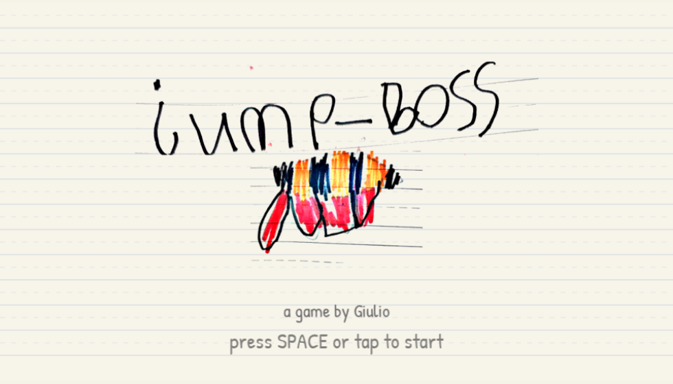
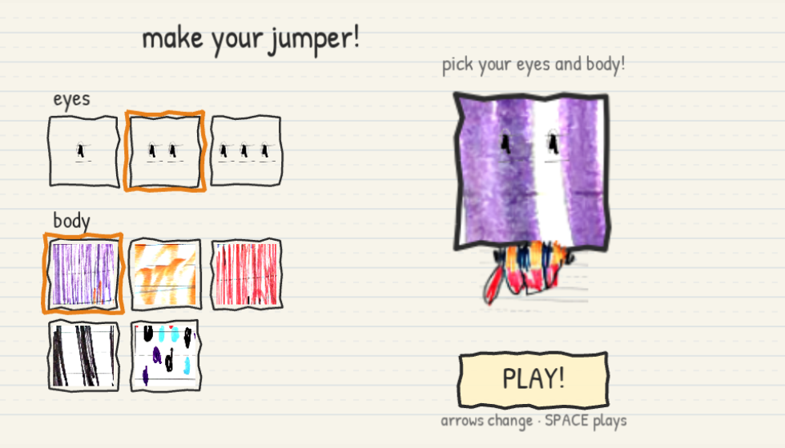
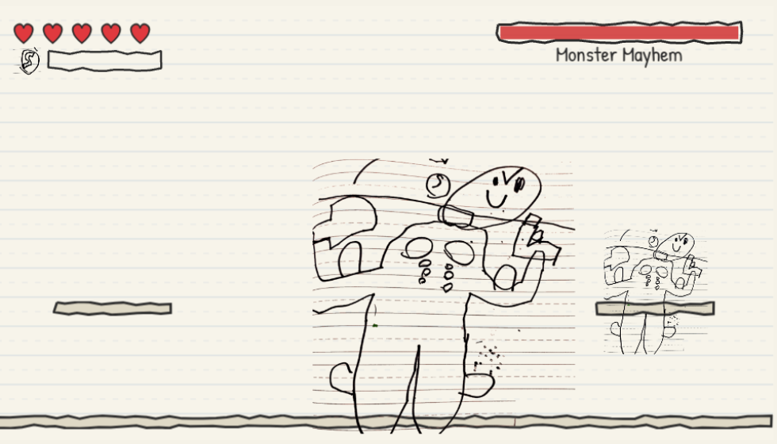
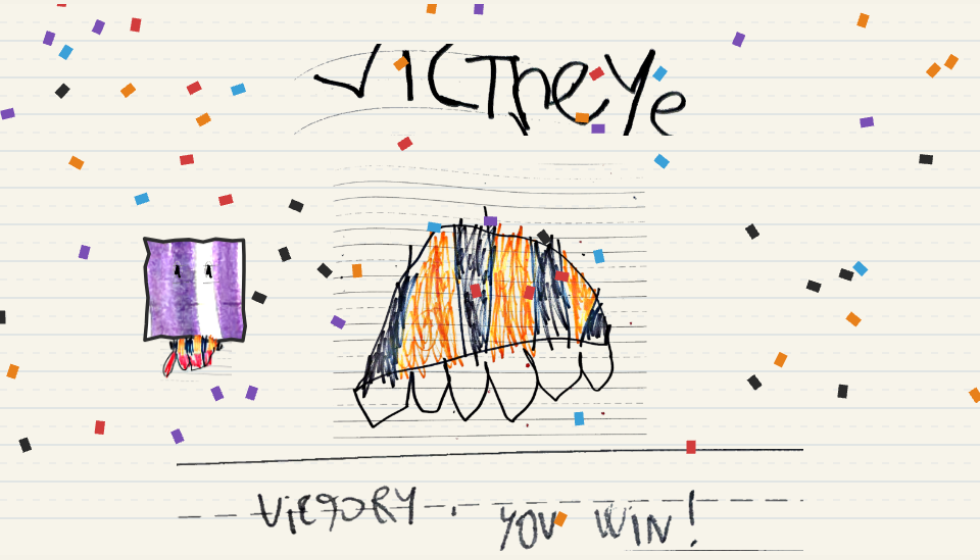

# Jump Boss

A platform fighting game designed by **Giulio, age 6** — drawn in his notebook,
scanned into `jump-boss.pdf`, and built exactly as designed. His marker drawings
*are* the game's sprites, and the whole game lives on ruled notebook paper.



Build your jumper (pick how many eyes and which scribble your body is made of),
climb the platforms collecting power-ups, and defeat all four monsters:
Monster A, Monster B (he has a knife *and* a gun), the mutant monster
Huggie Wagye, and finally Monster Mayhem — ideally by turning into a monster
yourself.

| | |
|---|---|
|  |  |
| Pick eyes + body | Muscle Mayhem vs Monster Mayhem |



## How to play

- **Arrow keys / WASD** — move
- **SPACE / up** — jump, and press again in mid-air for a **double jump**
  (grab *Big Jumps* to jump twice as high, *2x Speed* to run faster)
- **E / Shift** — when the special meter is full (collect two X's): transform
  into **Muscle Mayhem** — invincible, and you damage bosses by touching them
- **Jump on a monster's head** to hurt it. Monster A's chest **X** is his weak
  spot — stomp him, then touch the X while he's dizzy!
- **C** on the title screen shows the credits

Losing all five hearts just restarts the current screen. Nobody gets stuck.

## Sounds & music

All audio is synthesized in code — there are no audio files. The speaker icon
in the top-right corner (or the **M** key) mutes everything, and the choice is
remembered.

To change how things sound, edit the numbers and the dev server reloads
instantly:

- **Sound effects** — `src/audio/sfx.ts`, the `SFX_DEFS` table: one entry per
  effect (jump, stomp, hurt, pickup, transform, fanfare) with the wave shape
  (`square`/`sine`/`triangle`/`sawtooth`), a start→end frequency sweep in Hz,
  duration and volume; adding a `notes: [...]` list plays a tiny arpeggio
  instead of a sweep.
- **Music** — `src/audio/music.ts`, the `TRACKS` table: each track (title,
  level, boss, victory) is a tempo plus voices made of notes
  `n(startBeat, pitch, lengthInBeats)`, with pitches from the `N` table.
- Prefer real recorded sounds? Free CC0 packs (e.g. kenney.nl) can be dropped
  into `public/assets/`, loaded in `BootScene`, and played through Phaser's
  sound manager instead of the synth.

## Development

```bash
npm install
npm run dev        # local dev server
npm run check      # typecheck + tests + production build (run before commits)
npm run sprites    # re-extract all sprites from jump-boss.pdf (needs poppler + ImageMagick)
npm run sprites -- --sheet   # also builds a contact sheet for visual QA
```

- Game rules live in pure modules under `src/game/` (no Phaser imports) and are
  unit-tested with Vitest; Phaser scenes in `src/scenes/` are thin shells.
- Sprites are cropped from the PDF by `tools/extract-sprites.sh`; the crop
  table in that script is the single tunable surface. Extracted PNGs are
  committed under `public/assets/sprites/` — replace any of them with polished
  art of the same name whenever you like.
- Dev shortcut: append `?screen=bossA` (any of `title, select, platform,
  bossA, bossB, huggie, rip, mayhem, victory`) to jump straight to a screen.
- Design decisions and their rationale: [docs/DECISIONS.md](docs/DECISIONS.md).

## Release

Every push to `master` runs CI (typecheck + tests + build) and deploys to
GitHub Pages: **https://deccico.github.io/jump-boss/**

One-time setup: repo **Settings → Pages → Source: GitHub Actions** (and the
repo must be public for Pages on a free plan).

Visits are counted (cookie-free) by GoatCounter:
https://adrian2045.goatcounter.com
